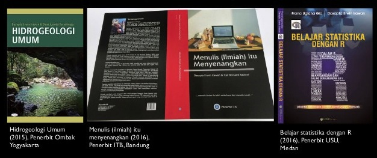
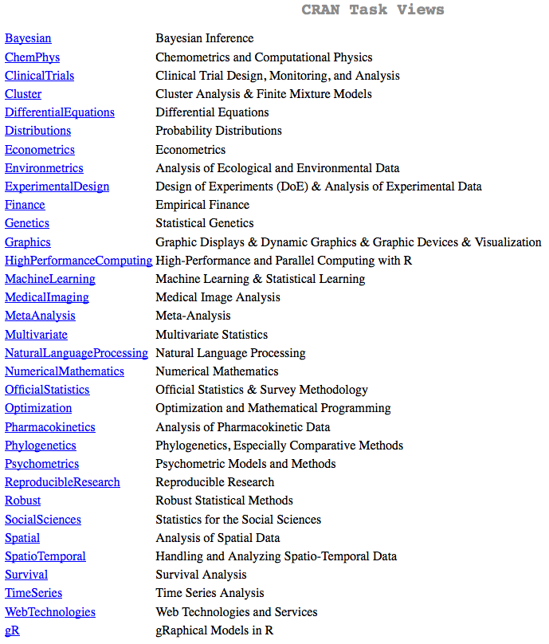

# intro

----

## about me

- Name: Dasapta Erwin Irawan
- Affiliation: Applied Geology, Faculty of Earth Sciences and Technology, Institut Teknologi Bandung
- Research interests: hydrogeology, hydrochemistry, open science, data analysis
- Education: Dept of Geology ITB 
    + S1 1994-1998
    + S2 1999-2001
    + S3 2005-2009

----

## my networks

- Socmed: 
    + [Twitter: dasaptaerwin](www.twitter.com/dasaptaerwin), 
    + [FB: dasaptaerwin](https://www.facebook.com/dasaptaerwin)
- repository:
    + R programming: [Github: dasaptaerwin](www.github.com/dasaptaerwin)
    + Hydrogeology: [figshare](www.figshare.com), [zenodo](www.zenodo.org), [osf](www.osf.io)
- blogs:
    + [(W)riting is (T)otally (F)un](dasaptaerwin.net/wp): talk about bits on writing and scientific communication and open science
    + [(H)ydrogeology's (2) (O)vercool](derwinirawan.wordpress.com)

----

## my books

- Irawan, DE. and Puradimaja, DJ., 2015, Hidrogeologi Umum, Penerbit Ombak.
- Irawan, DE. and Rachmi, CN., 2016, Menulis (ilmiah) itu menyenangkan, Penerbit ITB.
- Gio, PU. and Irawan, DE., 2016, Belajar Statistik dengan R, Penerbit USU.



----

## R history [From Wikipedia](https://en.wikipedia.org/wiki/R_%28programming_language%29)

- 1988: `R` was started as `S`
- 1993: first announces
- 1997: first on CRAN server
- now (20160413): stable release version 3.2.4 

----

## why R

- free and open source and cross platform (Linux, Mac, Windows)
- fairly mature and strong community
- cool kids use it

----

## R supports reproducibility 

- if you have the same data, copy paste the code from the original author, you'll get the same answer
- kind of strengthen the collaboration between: you (as a student) and your supervisor, you (as early career researcher) and the rest of the world

----

## What's R for?



----

# Computational chemistry

definition [Wikipedia/computational chemistry](https://en.wikipedia.org/wiki/Computational_chemistry):

```
Computational chemistry is a branch of chemistry 
that uses computer simulation to assist in solving 
chemical problems. It uses methods of theoretical 
chemistry, incorporated into efficient computer 
programs, to calculate the structures and properties of 
molecules and solids.
```

----

from [ACS](http://www.acs.org/content/acs/en/careers/college-to-career/chemistry-careers/computational-chemistry.html)

```
...Computational chemists' daily work influences 
our understanding of the way the world works, 
helps manufacturers design more productive and efficient 
processes, characterizes new compounds and materials, and 
helps other researchers extract useful knowledge from 
mountains of data.
```

```
... Many computational chemists develop and apply 
computer codes and algorithms, although practicing 
computational chemists can have rewarding careers 
without working on code development. 
Programming skills include compiling FORTRAN or C code, 
performing shell scripting with bash, Tcl/Tk, python, or perl, 
performing statistical analysis using *R* or SPSS, and 
working within a Windows, MacOS, or Linux environment...
```
----

built upon:

    - math
    - chemistry
    - computer science (as tools)
    
----
    
you will do a lot of:

    - clustering/classification
    - correlation
    - prediction
    - simulation and modeling
    - visualisation
    
----

```
R helps you to do part of those tasks
```

----

# let's dive in

----

## R installation

- similar to other programming language
- consists of:
    + R base
    + IDE - Integrated Development Environment (R studio)
- installing R base from [CRAN server](http://cran.at.r-project.org/)
- installing R Studio from [R Studio website](www.Rstudio.com)

----

## R components

- dataset
- code
- output
- interpretation

----

## dataset formats

- formats: non-binary is advised, use `csv`, `txt`.
- use database format (start from row 0, column 0).

----

## functions vs package

- built in functions
- custom-made functions
- packages:
    + built upon specific objectives
    + consist of a set or sets of functions

----

- frequently used package (most of the times) will be adopted as built in functions
- so if you can write one, and many people use it, then you're a famous person

----

## typical work flow

- getting and formatting data set
- formulating questions
- build and run the code
- analyse and visualise 
- and interpret the results

----

## basic programming

reading data

```
object <- read.csv("datafile.csv")
```

running a function
```
object <- function(arguments)
```

----

# recommended efforts

- be brave, dive in and get wet
- know your objectives
- "how to .... in R" will be your favorite sentence
- be analytical with your online search
- share your experience, you might get suggestions from fellow R users, use `#rstats` in your tweets

----

# useful links

- From Indonesian:
    + [My R Github repo, ITB](https://github.com/dasaptaerwin/R-for-beginners)
    + [Prana Ugi statistics, USU](http://www.rpranaugi.com)
    + [Tirta, I.M., 2005, Panduan Program Statistika R, Unej](https://docs.google.com/viewer?url=http%3A%2F%2Ftirtamade.blog.unej.ac.id%2Fwp-content%2Fuploads%2F2014%2F10%2FRcomManSld.pdf)
    + [Suhartono, 2008, Analisis data statistik dengan R, ITS](https://www.academia.edu/5532752/_Suhartono_Analisis_Data_Statistik_dengan_R)

----

- From the rest of the world:
    + [ChemmineR: Cheminformatics Toolkit for R](https://www.bioconductor.org/packages/3.3/bioc/vignettes/ChemmineR/inst/doc/ChemmineR.html)
    + [Chemometrics and Computational Physics](https://cran.r-project.org/web/views/ChemPhys.html)
    + [List of resources for to learn R](http://stats.stackexchange.com/questions/138/free-resources-for-learning-r)
    + [Quick R](www.statmethods.net/)
    + [Statistics and R G+ Community](https://plus.google.com/u/0/communities/117681470673972651781)